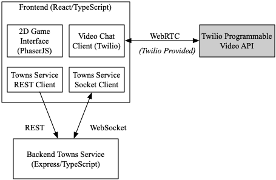

# Covey.Town

Covey.Town provides a virtual meeting space where different groups of people can have simultaneous video calls, allowing participants to drift between different conversations, just like in real life.
Covey.Town was built for Northeastern's [Spring 2021 software engineering course](https://neu-se.github.io/CS4530-CS5500-Spring-2021/), and is designed to be reused across semesters.
You can view our reference deployment of the app at [app.covey.town](https://app.covey.town/), and our project showcase ([Spring 2022](https://neu-se.github.io/CS4530-Spring-2022/assignments/project-showcase), [Spring 2021](https://neu-se.github.io/CS4530-CS5500-Spring-2021/project-showcase)) highlight select student projects.

The figure above depicts the high-level architecture of Covey.Town.
The frontend client (in the `frontend` directory of this repository) uses the [PhaserJS Game Library](https://phaser.io) to create a 2D game interface, using tilemaps and sprites.
The frontend implements video chat using the [Twilio Programmable Video](https://www.twilio.com/docs/video) API, and that aspect of the interface relies heavily on [Twilio's React Starter App](https://github.com/twilio/twilio-video-app-react). Twilio's React Starter App is packaged and reused under the Apache License, 2.0.

A backend service (in the `townService` directory) implements the application logic: tracking which "towns" are available to be joined, and the state of each of those towns.

## Running this app locally

Running the application locally entails running both the backend service and a frontend.

### Setting up the backend

To run the backend, you will need a Twilio account. Twilio provides new accounts with $15 of credit, which is more than enough to get started.
To create an account and configure your local environment:

1. Go to [Twilio](https://www.twilio.com/) and create an account. You do not need to provide a credit card to create a trial account.
2. Create an API key and secret (select "API Keys" on the left under "Settings")
3. Create a `.env` file in the `townService` directory, setting the values as follows:

| Config Value            | Description                               |
| ----------------------- | ----------------------------------------- |
| `TWILIO_ACCOUNT_SID`    | Visible on your twilio account dashboard. |
| `TWILIO_API_KEY_SID`    | The SID of the new API key you created.   |
| `TWILIO_API_KEY_SECRET` | The secret for the API key you created.   |
| `TWILIO_API_AUTH_TOKEN` | Visible on your twilio account dashboard. |

### Starting the backend

Once your backend is configured, you can start it by running `npm start` in the `townService` directory (the first time you run it, you will also need to run `npm install`).
The backend will automatically restart if you change any of the files in the `townService/src` directory.

### Configuring the frontend

Create a `.env` file in the `frontend` directory, with the line: `REACT_APP_TOWNS_SERVICE_URL=http://localhost:8081` (if you deploy the towns service to another location, put that location here instead)

### Running the frontend

In the `frontend` directory, run `npm start` (again, you'll need to run `npm install` the very first time). After several moments (or minutes, depending on the speed of your machine), a browser will open with the frontend running locally.
The frontend will automatically re-compile and reload in your browser if you change any files in the `frontend/src` directory.

# Our New Feature

Covey.Town is an instance of a cooperative workspace for virtual workers. Cooperation and group work need various basic elements to work: the ability to communicate, to look at the same files, and so on. Covey.Town had these features in some capacity, but what was missing was the ability to know when others would be on the platform in the first place. Most cooperative tools have some form of shared access calendar, to know when people would be available, when meetings would be, etc. As such we decided this would be a useful feature to implement to elevate Covey.Town’s utility.

CalendarAreas are parts of the map that users can enter to access a shared calendar that is a part of that area. Any user can add and delete events, allowing groups to know when others will be online using Covey.Town, rather than using an external tool like Outlook or SMS.

## Instructions to Access Our New Feature

1. Enter a deployed version of our Covey.Town app. 
2. Navigate to the conversationArea found in the beige room
  a. Through the left door, and then straight up
3. Enter the conversationArea, press space, and select a name for the area, creating the base calendar
  a. Each area has one calendar as of our current implementation. A piece of future work we identified was being able to group multiple calendars to an area.
4. You now have access to the base calendar:
5. To create an all-day event, click a day from the “month” or “week” view. To create an event for a fragment of time within a day, go to the “day” view, navigate to the desired day using the arrows, and use a click-and-drag motion to create the event:
6. To delete an event, select the event, and click delete.
